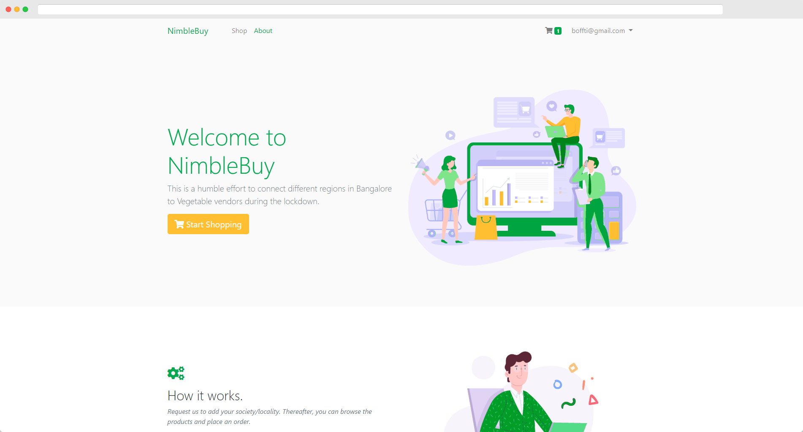
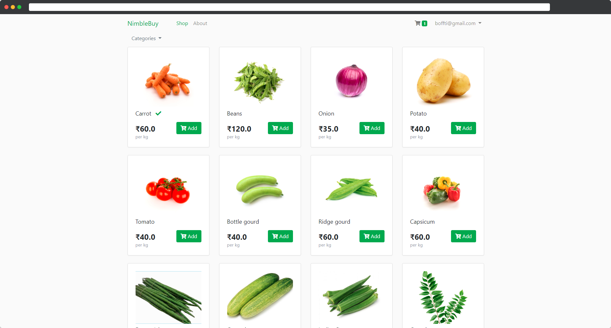

# NimbleBuy


This project/venture was started by my family and I during the COVID-19 lockdown period. We have identified some Grocery vendors who are going out of business and are connecting them to consumers in apartments and other communities.
We currently fulfill about 500+ orders per day in Bangalore, India and have about 50+ items in our inventory. We homedeliver fresh, organic fruits vegetables and other items at very competitive prices.
As this project was done during my pursual of the Full Stack Developer Nanodegree on Udacity, I decided to submit the same as the capstone. The project is entirey constructed from FLASK with Auth0 serving as the Login Manager.
The website can be found [here](https://www.nimblebuy.in/about).

  

## Getting Started

### Installing Dependencies

#### Python 3.7

Follow instructions to install the latest version of python for your platform in the [python docs](https://docs.python.org/3/using/unix.html#getting-and-installing-the-latest-version-of-python)

#### Virtual Environment

We recommend working within a virtual environment whenever using Python for projects. This keeps your dependencies for each project separate and organized. Instructions for setting up a virtual environment for your platform can be found in the [python docs](https://packaging.python.org/guides/installing-using-pip-and-virtual-environments/)

#### PIP Dependencies

Once you have your virtual environment setup and running, install dependencies by navigating to the project directory and running:

```bash
pip install -r requirements.txt
```

This will install all of the required packages we selected within the `requirements.txt` file.

##### Key Dependencies

- [Flask](http://flask.pocoo.org/)  is a lightweight backend microservices framework. Flask is required to handle requests and responses.

- [SQLAlchemy](https://www.sqlalchemy.org/) is the Python SQL toolkit and ORM we'll use handle the lightweight sqlite database. You'll primarily work in app.py and can reference models.py. 

- [Flask-CORS](https://flask-cors.readthedocs.io/en/latest/#) is the extension we'll use to handle cross origin requests from our frontend server. 


## Running the server

From within the `project` directory first ensure you are working using your created virtual environment.

To run the server, execute:

```bash
export FLASK_ENV=development
flask run
```

Setting the `FLASK_ENV` variable to `development` will detect file changes and restart the server automatically.


### Running the App

To run the sample, make sure you have `python` and `pip` installed.

Rename `.env_example` to `.env` and populate it with the client ID, domain, secret, callback URL and audience for your
Auth0 app. If you are not implementing any API you can use `https://YOUR_DOMAIN.auth0.com/userinfo` as the audience. 
Also, add the callback URL to the settings section of your Auth0 client.

Register `http://localhost:3000/callback` as `Allowed Callback URLs` and `http://localhost:3000` 
as `Allowed Logout URLs` in your client settings.

Run `pip install -r requirements.txt` to install the dependencies and run `python server.py`. 
The app will be served at [http://localhost:3000/](http://localhost:3000/).

### Running the App with Docker

To run the sample, make sure you have `docker` installed.

To run the sample with [Docker](https://www.docker.com/), make sure you have `docker` installed.

Rename the .env.example file to .env, change the environment variables, and register the URLs as explained [previously](#running-the-app).

Run `sh exec.sh` to build and run the docker image in Linux or run `.\exec.ps1` to build 
and run the docker image on Windows.

## What is Auth0?

Auth0 helps you to:

* Add authentication with [multiple authentication sources](https://auth0.com/docs/identityproviders),
either social like **Google, Facebook, Microsoft Account, LinkedIn, GitHub, Twitter, Box, Salesforce, among others**,or 
enterprise identity systems like **Windows Azure AD, Google Apps, Active Directory, ADFS or any SAML Identity Provider**.
* Add authentication through more traditional **[username/password databases](https://docs.auth0.com/mysql-connection-tutorial)**.
* Add support for **[linking different user accounts](https://auth0.com/docs/link-accounts)** with the same user.
* Support for generating signed [JSON Web Tokens](https://auth0.com/docs/jwt) to call your APIs and
**flow the user identity** securely.
* Analytics of how, when and where users are logging in.
* Pull data from other sources and add it to the user profile, through [JavaScript rules](https://auth0.com/docs/rules).

## Create a free account in Auth0

1. Go to [Auth0](https://auth0.com) and click Sign Up.
2. Use Google, GitHub or Microsoft Account to login.

## Database Setup

This project uses a SQLite DB locally to build and test quickly and uses Postgres on Heroku.
Within the project folder in terminal run:

```bash
python

>>> from app import import_db

>>> import_db()
```

<hr>

## Testing
To run the tests, run
```bash
dropdb nimblebuy_test
createdb nimblebuy_test
python test.py
```

## Hosting
This app is deployed on heroku and can be found [here](https://nimblebuy.herokuapp.com/).
It is currently running on Hobby Dynos.

To host your app follow these steps - 
 - Create a `Procfile` in the project directory.
 - Inside the Procfile put the following
 ```text
 web: gunicorn app:app
 ```
 - Push the entire project to GIT
 - Go to Heroku and create a new app
 - Link your Github account on heroku
 - Link the project Github repo in the Heroku App Settings
 - Configure it for auto deployment
 - In Heroku App Setting, copy all the `.env` file contents.
 - Add a hobby dev Postgres server from Heroku addons

<hr>

## Author

#### Aneesh Melkot
 [](http://github.com/boffti)s

This sample demonstrates how to add authentication to a Python web app using Auth0.


